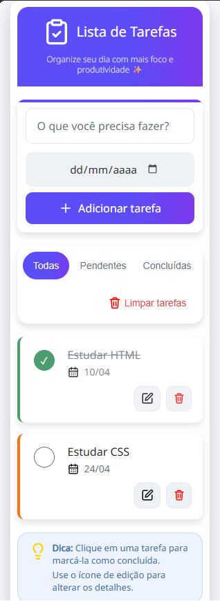
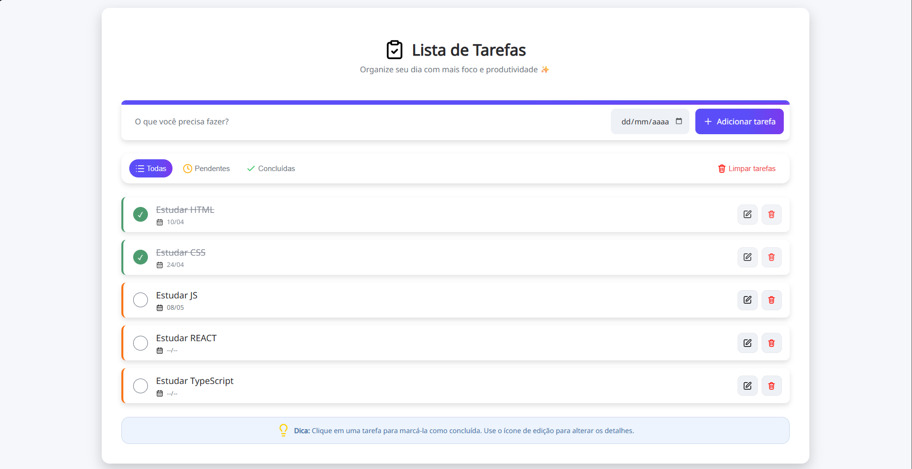
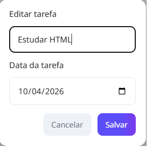

# 📋 Lista de Tarefas (To-Do List)

### Aplicação web de lista de tarefas desenvolvida com **HTML, CSS e JavaScript puro**, com foco em prática de manipulação do DOM, responsividade e organização de código.

---

## 🖼️ Preview do projeto

### 📱 Mobile



---

### 💻 Desktop



---

### ✏️ Modal de edição



---

## 🚀 Demonstração

🔗 Acesse o projeto:
👉 [Link do projeto publicado](#)

---

## 🎯 Objetivo

Este projeto foi desenvolvido com o objetivo de:

* Praticar manipulação do DOM com JavaScript
* Trabalhar com eventos e estado da aplicação
* Implementar um CRUD completo
* Aplicar conceitos de responsividade (mobile first)
* Criar uma interface limpa e funcional

---

## ✨ Funcionalidades

### 📝 Tarefas

* Adicionar novas tarefas
* Editar tarefas existentes (via modal)
* Excluir tarefas
* Marcar como concluída ou pendente

### 📅 Data

* Adicionar data opcional à tarefa
* Editar ou remover data no modal
* Exibição formatada (dd/mm)
* Indicador visual quando não há data

### 🔎 Filtros

* Visualizar todas as tarefas
* Filtrar por tarefas pendentes
* Filtrar por tarefas concluídas

### 🧹 Limpeza

* Remover todas as tarefas com um clique

### 💾 Persistência

* Armazenamento no **LocalStorage**
* Dados mantidos mesmo após recarregar a página

### 📱 Responsividade

* Layout adaptado para:

  * Mobile
  * Tablet
  * Desktop

---

## 🛠️ Tecnologias utilizadas

* HTML5
* CSS3
* JavaScript (Vanilla JS)
* LocalStorage API

---

## 📂 Estrutura do projeto

```bash
📁 projeto
 ┣ 📄 index.html
 ┣ 📁 src
 ┃ ┣ 📁 assets
 ┃ ┃ ┣ 📁 icons
 ┃ ┃ ┗ 📁 fonts
 ┃ ┃ ┗ 📁 images
 ┃ ┣ 📁 styles
 ┃ ┃ ┣ 📄 reset.css
 ┃ ┃ ┣ 📄 global.css
 ┃ ┃ ┗ 📄 todo-list.css
 ┃ ┗ 📁 scripts
 ┃   ┗ 📄 main.js
```

---

## 🧠 Conceitos aplicados

* Manipulação de elementos com `createElement`
* Controle de estado com variáveis (`currentFilter`, `currentTaskIndex`)
* Renderização dinâmica da interface
* Separação de responsabilidades (funções específicas)
* Uso de `localStorage` para persistência
* Formatação de dados (datas)
* Eventos (`click`, `submit`, `change`)

---

## 👨‍💻 Autor

Desenvolvido por **Alexsander Galvão**

* GitHub: https://github.com/AlexsanderGS
* LinkedIn: www.linkedin.com/in/alexsander-galvao

---

## 📄 Licença

Este projeto está sob a licença MIT.
